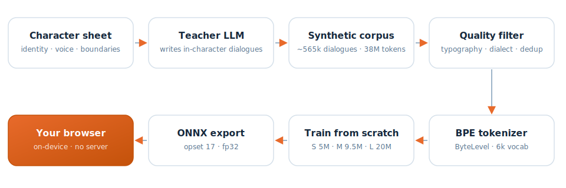
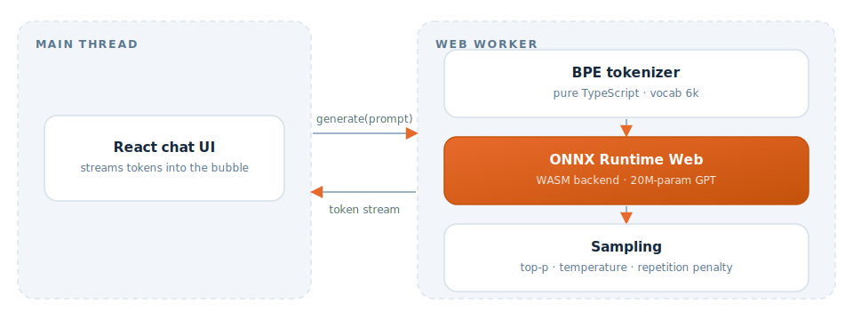

# Nicu

A small, from-scratch Sicilian character AI (three sizes, 5M-20M parameters)
that runs entirely in your browser.

## What is this

Nicu is a small, from-scratch language model family (no pretrained base, no
fine-tuning of an existing LLM) that plays a single character: **Nicu, a
friendly guy from Catania, Sicily**. He talks about the sea, the grill, his
friends, Sant'Agata — his small world. Ask him anything outside of it (the
capital of France, how to fix your car, world news) and he **deflects
instead of making things up**. That's by design, not a bug: a model this
small can't reliably hold facts about the whole world, so instead of
hallucinating it stays in character and dodges — usually with a joke about
horse-meat polpette.

The model was trained with **distillation**: a large teacher LLM generated a
synthetic corpus of ~565k in-character dialogues (a "character sheet" defines
who Nicu is, his voice, and his boundaries), and each model learned the
character from that corpus, from randomly initialized weights. The
character's quality is bounded by the corpus, not by clever prompting at
inference time — there is no prompting at inference time, just a tiny GPT
doing next-token prediction.

## How it was made

<picture>
  <source media="(prefers-color-scheme: dark)" srcset="assets/pipeline-dark.svg">
  
</picture>

- **Character sheet** — a Markdown contract fixing Nicu's identity, voice,
  recurring moves, and the boundary of what he knows.
- **Teacher LLM** — generates in-character dialogues plus deflections for
  out-of-domain prompts, following that contract.
- **Quality filter** — dialect/typography cleanup, dedup, format checks.
- **BPE tokenizer** — trained on the cleaned corpus, 6,000 tokens.
- **Train from scratch** — three sizes (S/M/L, see [Models](#models)) trained
  independently on the exact same tokenized corpus.
- **ONNX export + browser** — each checkpoint is exported to ONNX and served
  as a static file; there is no inference server.

## Try it

**https://nicu.mango-dev.space** (soon: `nicu.chat`)

Everything after the page loads runs on your device. No account, no server
doing inference, works offline once cached.

## How it runs in the browser

Nicu ships as a plain ONNX graph and runs through **ONNX Runtime Web**,
pinned to a WASM-only build (no WebGPU) so it works consistently across
devices — including older iOS Safari, which is the whole reason for the
WASM-only pin (see `web/README.md` for the story). Inference happens inside
a **Web Worker** so the UI thread stays free to animate the chat while the
model generates, streaming one token at a time. Tokenization is a
from-scratch **ByteLevel BPE implementation in plain TypeScript**
(`web/src/lib/tokenizer.ts`) — no WASM tokenizer dependency, it just reads the
same `bpe_synth.json` vocab/merges file the Python training pipeline produced.

Relevant files: `web/src/lib/inference.worker.ts` (model + sampling loop),
`web/src/lib/inference.ts` (public API + worker/main-thread fallback),
`web/src/lib/tokenizer.ts` (BPE).

<picture>
  <source media="(prefers-color-scheme: dark)" srcset="assets/runtime-dark.svg">
  
</picture>

## Models

Three sizes, all trained from scratch on the **exact same corpus** (~565k
dialogues, 6,000-token BPE vocab, 512-token context) — so they form a clean
size-scaling comparison for a character model, not three different training
runs.

| Size | Layers | Heads | Embedding dim | Parameters | File size (fp32) | Download |
|---|---|---|---|---|---|---|
| S | 9 | 8 | 192 | 5.25M | ~21 MB | coming with v1.0 |
| M | 10 | 8 | 256 | 9.57M | ~38 MB | coming with v1.0 |
| **L** (default, live) | 15 | 8 | 320 | 20.6M | ~84 MB | [federico-anastasi/nicu-20m](https://huggingface.co/federico-anastasi/nicu-20m) |

All three share: vocab size 6,000 (ByteLevel BPE, trained on the synthetic
corpus), context/block size 512 tokens, fp32 precision, nanoGPT-style
decoder-only transformer architecture, exported to ONNX (opset 17) via
`tools/export_onnx.py`.

**Default / recommended: L** — it's the version running at the live demo
above. S and M exist for size-scaling comparisons and lower-end devices.

## Run locally

```bash
git clone https://github.com/Federico-Anastasi/nicu-chat.git
cd nicu-chat/web
npm install                 # also copies ONNX Runtime's .wasm binaries into public/wasm/
# download an .onnx from Hugging Face (see Models above) into web/public/
npm run dev                 # http://localhost:5173
```

`npm run build` works without the model file present (it just type-checks
and bundles); you need an `.onnx` in `web/public/` to actually chat with
Nicu.

To run a size other than the default, download that size's `.onnx` into
`web/public/` and update two places to match its filename: the hardcoded
model path in `web/src/App.tsx` (currently `/nicu-l-v9-sft.onnx`) and
`MODEL_ID` in `web/src/lib/inference.ts` (currently `nicu-L-v9-sft`, used
only for logging which model served a conversation — it doesn't drive the
load path).

## What's NOT here

The data generation pipeline (the character sheet, the prompt engine that
seeds the teacher LLM, the corpus itself, training/eval scripts) stays
private — this repo only has the trained model's runtime (the browser app)
and the export tool used to produce the `.onnx` file.

## Author

Federico Anastasi — [@FedeAnastasi](https://x.com/FedeAnastasi)

## License

Code: MIT (see `LICENSE`). Model weights: CC-BY-NC-4.0 (see `MODEL_CARD.md`).
